# splunk-soc-labs

SOC analyst labs - investigating the brute force, privilege escalation and persistence using Splunk. I'm new to cybersecurity and using these labs to build real analytical skills, so I'm documenting not just what I have found but how how I thought through each investigation.

**Tools used:** Splunk, auth.log, syslog
**Platform:** Tryhackme

## Lab 1 - You are an SOC Lebel 1 Analyst on shift and have received an alert indicating possible persistence through the creation of a new remote-ssh user on an Ubuntu server. Your task is to dive into the logs and determine exactly what happend on the system.

A series of tasks based on analyzing auth.log entries in Splunk. The goals was to reconstruct a sequence of events: someone created a backdoor account, but to get there, I had to trace back who did it and how they got access in the first place.

### Task 1 - When was the backdoor account created?

I needed to find the exact timestamp of a remote-ssh account creation. Account creation events in Linux get logged to auth.log, so I filtered by that source and looked for useradd or new user events. Found the timestamp from there.

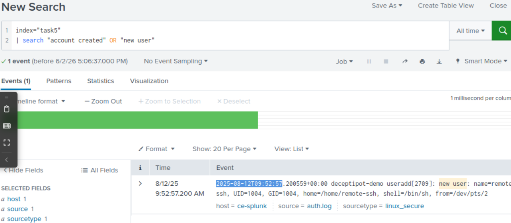

### Task 2 — Who escalated privileges before creating the account?

The question was: who had root access right before that account appeared? Privilege escalation on Linux usually happens through su or sudo, so I added those to my filter. That's how I found the user — **jack-brown**.
This task taught me that in a real investigation you work backwards. The backdoor account is the symptom, not the cause, the real event was someone escalating to root first.

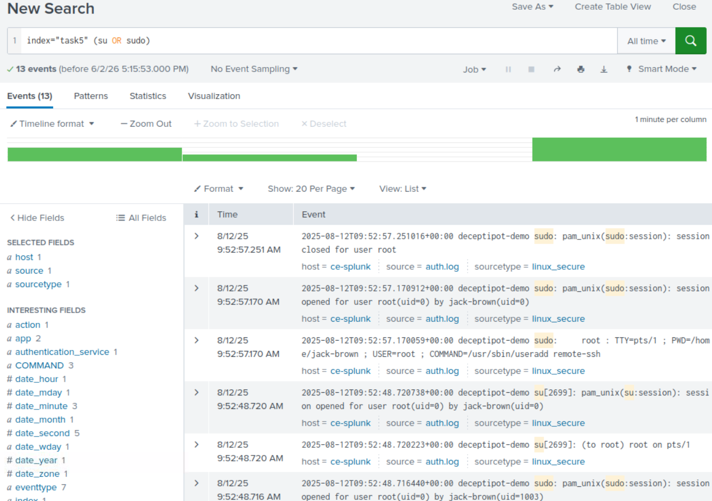

### Task 3 — Where did jack-brown log in from?

Now that I knew the user, I filtered for SSH login events tied to jack-brown. The logs showed the source IP address of the successful login.

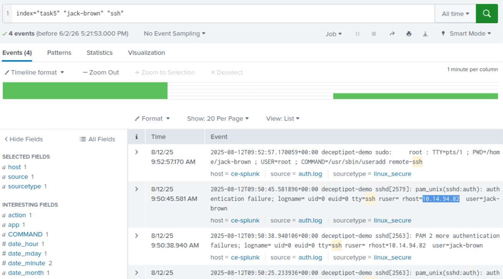

### Task 4 — How many failed attempts before the successful login?

I filtered for failed password in the logs. The answer was **4 failed attempts** before the login succeeded. That's a small number, so this wasn't a large automated brute force attack — more likely someone who already had a partial idea of the credentials.

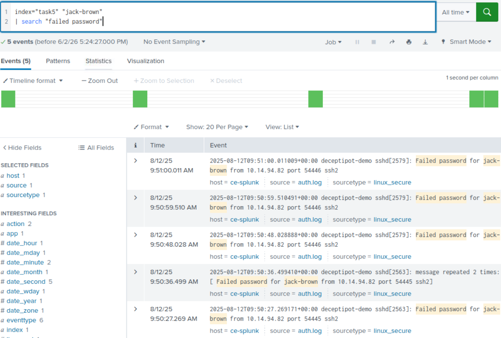

### Task 5 — How is the persistence mechanism connecting back?

Persistence mechanisms (ways attackers make sure they keep access even after a reboot) tend to show up in syslog rather than auth.log, because they involve services and scheduled jobs rather than logins. I filtered `source=syslog` and found the port the backdoor was configured to connect to.

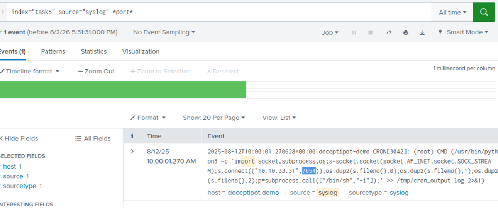

---

## Lab 2 - Brute Force Alert Investigation

**A real alert scenario I received:**

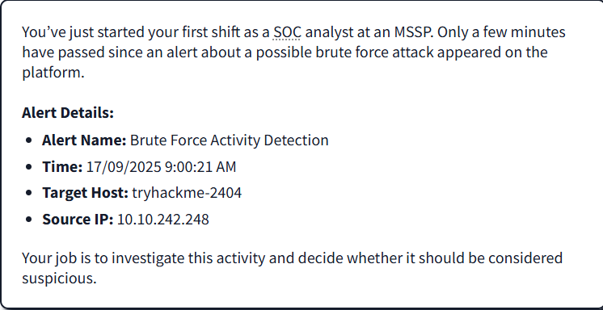

**How I started:** I filtered by sourcetype, IP, and the index provided in the lab. Almost immediately something stood out - the user john.smith had a huge number of failed login attempts in a very short time window.

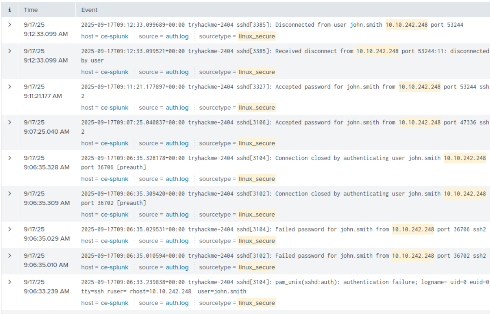

**What I found:** Filtering by action values showed **631 failed login attempts**. That number alone is a strong indicator of brute force. But what confirmed it was finding **3 successful logins** mixed in - meaning the attacker eventually got through. The host tryhackme-2404 was compromised.

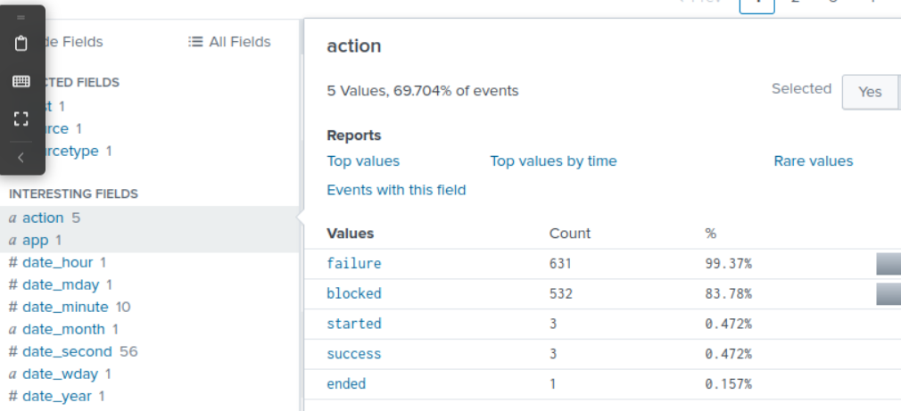

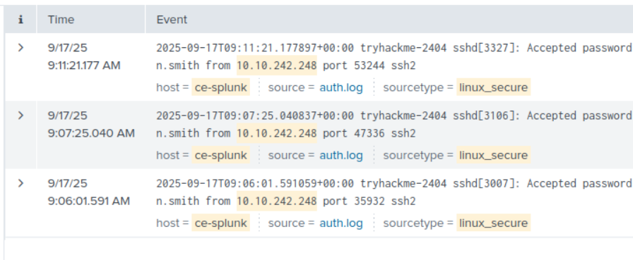

**Conclusion:** True Positive. 631 failures followed by successful logins is textbook credential stuffing - cycling through passwords until one works.

---

## Lab 3 — Malicious Scheduled Task Investigation

**The alert:** Suspicious activity linked to a scheduled task named AssessmentTaskOne.

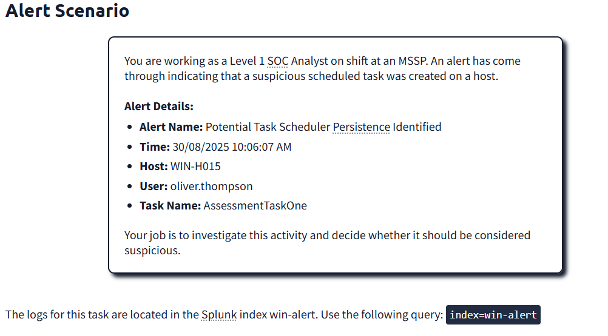

**How I started:** I searched for the task name in Splunk and filtered by the known activity timestamp to narrow the results down quickly. Three events came back.

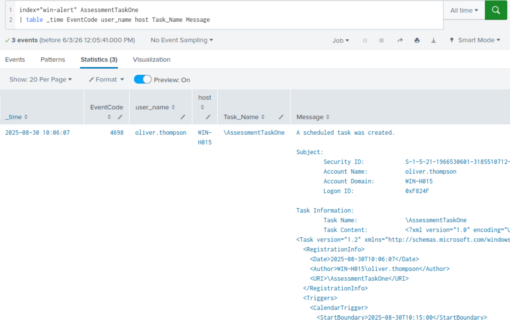

**What I found:** The first event had everything. Looking at the Message field, I could see a scheduled task configured to run every day at **10:15**. Breaking down what it was doing:

- Used certutil — a legitimate Windows built-in tool to download rv.exe from a suspicious domain (tryhotme - note the typo, a common evasion trick)
- Saved to the Temp folder under the name DataCollector.exe designed to look innocent
- Executed using Start-Process PowerShell
- All running under the user account oliver.thompson

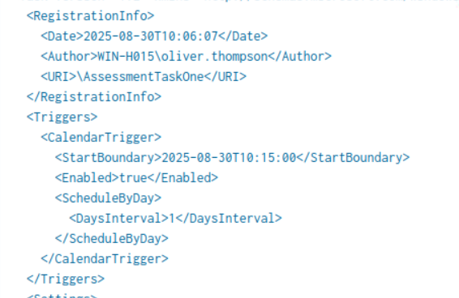

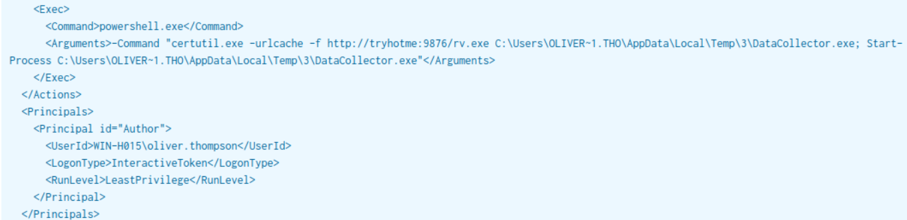

**Conclusion:** True Positive. This is a persistence mechanism, a daily scheduled task downloading and running a payload. Certutil abuse, a typosquatted domain, a disguised filename, and a recurring schedule are all clear red flags.
